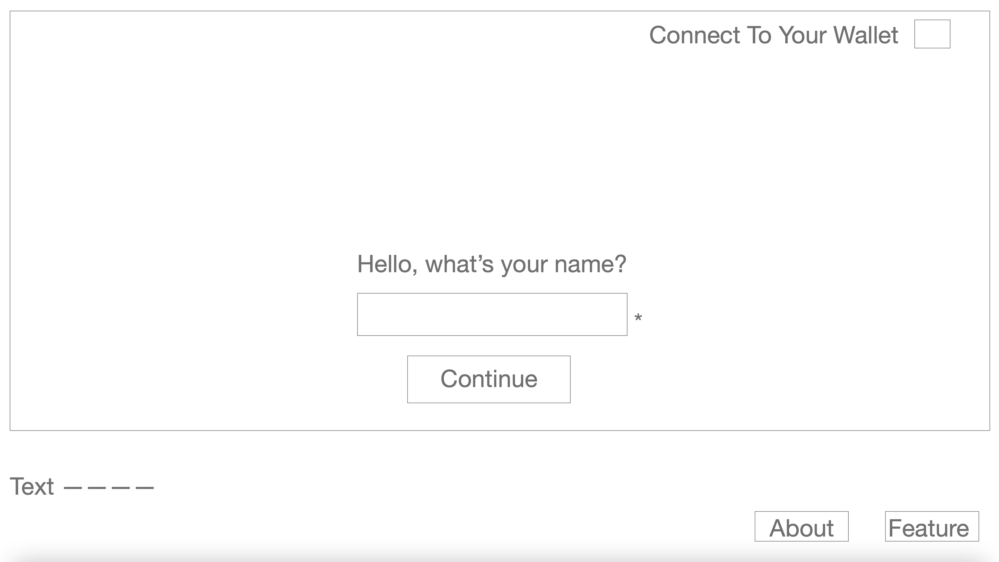
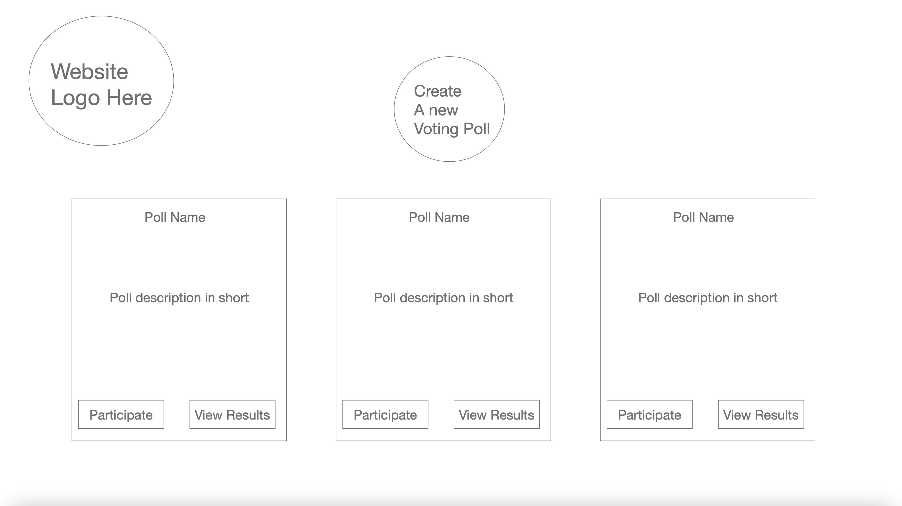
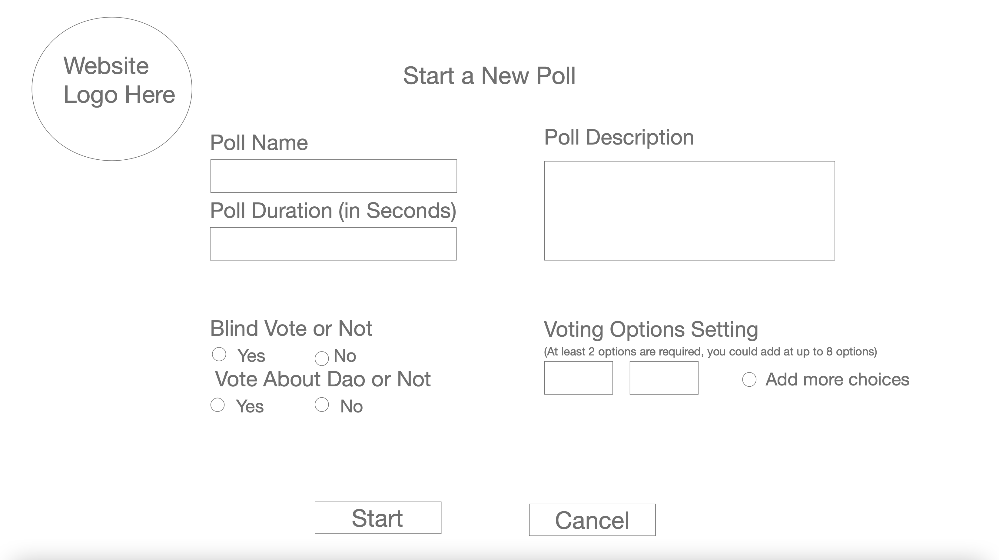
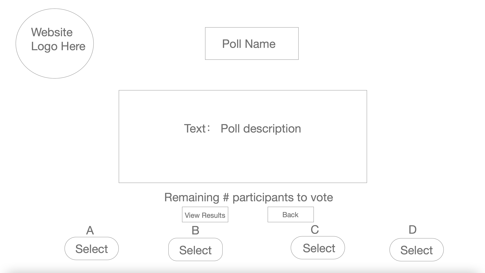
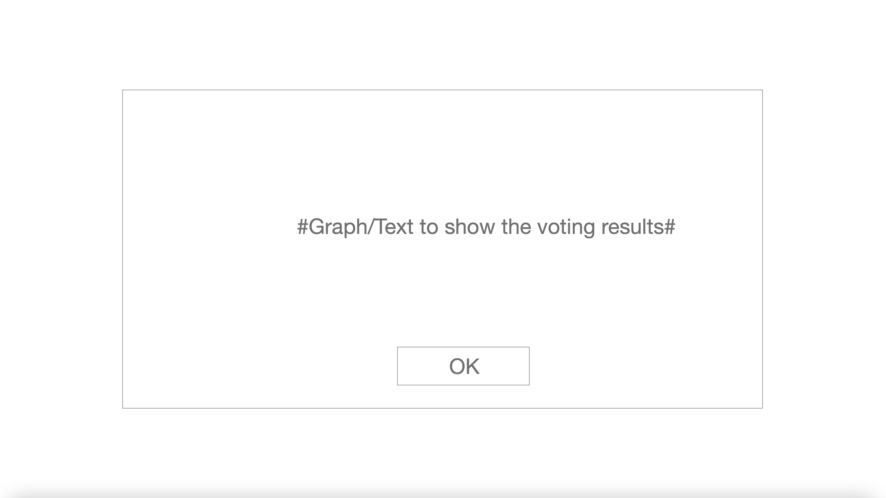
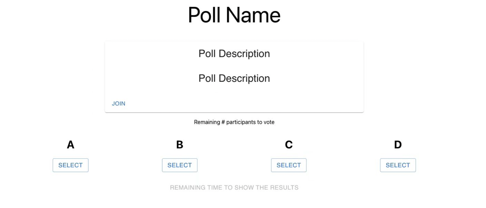
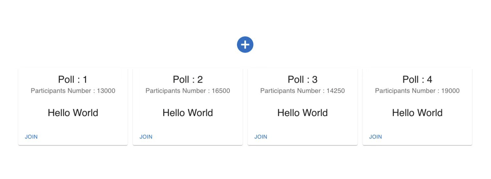

# Whitepaper 

[Run Hardhat Instructions](docs/hardhat.md)
 
[Run Website Instructions](docs/node.md)

## Introduction 
Online voting is a trend that is gaining momentum in our society. It lowers the organizational costs and potentially increases voter turning. It eliminates the need to prepare ballot papers and open polling stations, which means voters can vote as long
as there is a secure internet connection. Our application is designed to allow users to create voting events with many features using blockchain technologies, which will be proved useful in open source communities. People can propose a change of design or new development ideas, and stakeholders in the community can vote to pass or reject this proposal.

## Features
1.	The resources, including the power to organize an event and vote an event, are shared among community.
2.	The decision of proposed events is made by everyone in the community.
3.	The accountability of voting results lies in every individual in the community.

## Basic Functions
### Participant ```struct Participant```
-	can create a voting event with various features such as blind voting and tags.
-	can vote in any event as long as a gas fee is paid.
- can re-vote in any ongoing event without paying any extra fees.

### Voting Event ```struct PollEvent```
-   is associated with a voting event id ```uint pollId``` and can be viewed in public ```mapping(uint => PollEvent) public polls```;
-	has a mechanism to end the voting with timed stop ```uint votingDuration```;
-   has a mechanism to present results in real time or encrypted them before poll ends ```bool blind```.


### Poll Result ```struct PollResult```
-   is associated with a voting event id ```uint pollId```, but can not be viewed publicly. ```mapping(uint => PollResult) private pollResults```;
-   can present events having a tie ```bool tie```.

## Additional Functions
-   Filter with blind voting 
-   Filter with votes created by me
-   Filter with poll type (a concrete proposal, such as saving🐰 or protect 🌲; or proposals on directions of changing the dao/dapp)

## Wireframe (How Contract and Front-end Are Related)
- View 1: Connect to wallet, login/ register
```
event participantRegistered(string name);
event participantLoggedIn(string name);
```



- View 2: view existing polls with filters
```
event pollsViewed(uint[] pollIds);
```



- View 3: create a new poll event
```
event pollCreated(address organizer, string name, uint dur, bool blind, bool aboutDAO);
```



- View 4: view one poll and vote
```
event pollViewed(PollEvent poll);
event voteDone(address voter, bool voted);
```



- View 5: view results
```
event resultViewed(bool tie, Selection[] result, State state, bool blind);
```



- No control event, only determined by a poll's starting time and voting duration
```
event voteEnded(bool tie, Selection[] result);
```

## References

### News
- https://www.vice.com/en/article/bvn5am/andrew-yangs-web3-lobbying-group-wants-to-end-poverty-with-vote-buying
- https://blog.coinbase.com/cryptos-emergence-as-a-geopolitical-force-30f29d62e562

### Ballot contract starter code
- https://github.com/jacksonng77/ballot/blob/master/ballot.sol
- https://docs.soliditylang.org/en/v0.8.13/solidity-by-example.html

### Some famous DAO projects’ descriptions
- Gitcoin: https://github.com/Dapp-Learning-DAO/Dapp-Learning/tree/main/dao/gitcoinDAO
- Snapshot: https://snapshot.org/#/
- DAOhaus https://daohaus.club/
- Aragon https://github.com/Dapp-Learning-DAO/Dapp-Learning/tree/main/dao/Aragon

### Web3
- lecture recording: https://github.com/sparklin0812/dapp-tutorial
- alchemy: https://github.com/alchemyplatform/hello-world-part-four-tutorial
- alchemy: https://docs.alchemy.com/alchemy/tutorials/hello-world-smart-contract/part-4

## Some Philosophical Detours
- We find it interesting that DAO is pronounced the same way in a Chinese word "道". The saying by Chinese philosopher Lao Tzu, "道可道, 非常道", meaning that "the true way cannot be taught", precisely depicts the intricacies of DAO.
- The idea of timed stop follows what Neo–Confucian philosopher Wang Yangming said "你未看此花时，此花与汝同归于寂；你来看此花时，则此花颜色一时明白起来", which means that "the flower only blooms when you see it". By analogy to this, the poll only stops when someone checks it status, such as voting or reviewing results, in this contract. Aave also updates its interest rates in a similar way.


## Front-end Visualization


